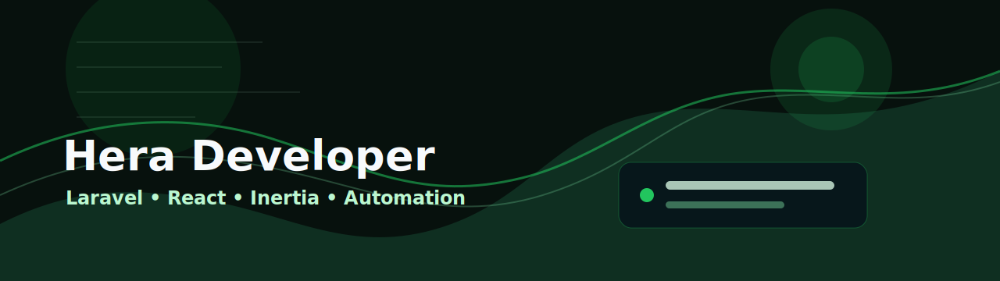

  

<h1 align="center">Hi, I'm Hera Developer</h1>

  Full-stack programmer building fast Laravel, React, and automation products.

  
  
  

---

## About Me

I design and ship web applications with clean architecture, sharp interfaces, and maintainable systems. My work focuses on Laravel, Inertia, React, MySQL, and practical automation for real product workflows.

I enjoy solving problems and building tools that make work simpler, faster, and easier to trust.

- Based in Indonesia
- Available for collaboration
- Building portfolio CMS, dashboards, learning platforms, and internal tools
- Interested in clean UI, maintainable backend systems, and useful automation

## Tech Stack

**Languages**

**Frontend**

**Backend**

**Database and Tooling**

## Featured Projects

| Project | Description | Stack |
| --- | --- | --- |
| [Laravel Commerce Dashboard](https://github.com/YOUR_GITHUB_USERNAME/laravel-commerce-dashboard) | Operational dashboard for orders, catalog management, and revenue analytics. | Laravel, React, MySQL, Tailwind |
| [YouTube Learning Hub](https://github.com/YOUR_GITHUB_USERNAME/youtube-learning-hub) | Playlist-based learning interface for structured programming video content. | Laravel, Inertia, React |
| [SaaS Billing Portal](https://github.com/YOUR_GITHUB_USERNAME/saas-billing-portal) | Subscription management portal with invoices, plan changes, and admin reporting. | Laravel, MySQL, Tailwind |
| [Realtime Support Desk](https://github.com/YOUR_GITHUB_USERNAME/realtime-support-desk) | Customer support dashboard with ticket queues, internal notes, and status tracking. | Laravel, React, Inertia |
| [Inventory Control System](https://github.com/YOUR_GITHUB_USERNAME/inventory-control-system) | Stock control application for purchasing, warehouse movement, and audit logs. | Laravel, MySQL, JavaScript |
| [Agency Portfolio CMS](https://github.com/YOUR_GITHUB_USERNAME/agency-portfolio-cms) | Content-managed portfolio system for publishing case studies and service pages. | Laravel, Inertia, React, Tailwind |

## What I Build

- Portfolio and company websites with editable CMS content
- Admin dashboards for operational workflows
- Laravel APIs with authentication, validation, queues, and clean data models
- React and Inertia interfaces that are fast, tidy, and easy to maintain
- Learning hubs, tutorial pages, and playlist-style video interfaces

## GitHub Stats

  
  

## Let's Talk

Whether you need a new website, a CMS, or a cleaner Laravel platform, feel free to reach out.

  <a href="mailto:hello@example.com">hello@example.com</a> |
  <a href="https://github.com/YOUR_GITHUB_USERNAME">GitHub</a> |
  <a href="https://linkedin.com/in/example">LinkedIn</a>

